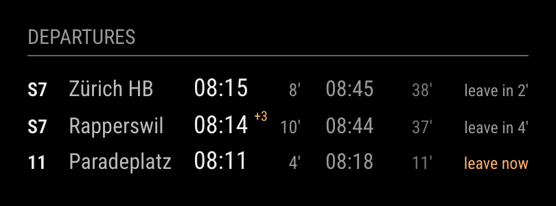
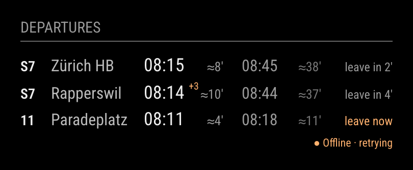

# MMM-SwissDepartures

A compact **Swiss public-transport departure board for MagicMirror²**. One line per
direction: the line, where it goes, the next two departures you can still catch
(timetable time with any delay, then minutes left) and **when to leave the house**
based on your walking time. Data comes from the free
[search.ch timetable API](https://search.ch/timetable/api/help); no API key needed.



<sub>Rendered by the included demo with synthetic departures: an S7 running three minutes late, and a tram to leave for right now.</sub>

- One line per direction, up to three directions; fits a 365 px column.
- Direction chosen by a **stop the vehicle passes** (`via`), its terminal, and/or the line.
- Departures you can no longer reach on foot are skipped; "leave in 4′" / "leave now".
- Delays (`+3`), cancellations (struck through `×`), platform changes and unusual status text.
- Boards on the same stop share **one request**; several browsers share cached results.
- Polls every 15 s in the morning peak, 30 s by day, 5 min overnight: within search.ch's daily limit.
- Redraws only when something visible changes. Stale and offline data are clearly marked.
- No API key, no `npm install`, no runtime dependencies. Runs on Node 10+ (old Raspberry Pi installs).

Works anywhere search.ch has a timetable: all of Switzerland (SBB, S-Bahn, trams, buses,
boats, cable cars) and some cross-border stops.

## Install

```sh
cd ~/MagicMirror/modules
git clone https://github.com/mkubicek/MMM-SwissDepartures.git
```

**No `npm install` is needed on the mirror.** Add the module to `config/config.js` and
restart MagicMirror.

```js
{
  module: "MMM-SwissDepartures",
  position: "top_right",
  header: "Departures",          // optional
  config: {
    boards: [
      // S7 at Zürich Stadelhofen towards Zürich HB, and the other way towards Meilen/Rapperswil.
      { label: "Zürich HB",   stop: "8503003", lines: ["S7"], via: "8503000", walkingMinutes: 5 },
      { label: "Rapperswil",  stop: "8503003", lines: ["S7"], via: "8503104", walkingMinutes: 5 },
      // Tram 11 at Zürich Bellevue towards Paradeplatz.
      { label: "Paradeplatz", stop: "8576193", lines: ["11"], via: "8591299", walkingMinutes: 3 }
    ]
  }
}
```

These are the module's defaults: public Zürich examples. Replace them with your own
stops (see below).

## Configuration

| Setting | Default | Meaning |
| --- | --- | --- |
| `boards` | the three Zürich examples above | Up to **three** directions, one line each; extra boards are ignored |
| `maximumEntries` | `2` | Departures per line, `1` or `2` |
| `staleAfter` | `90000` | Milliseconds after which data counts as stale (never more than three poll intervals, i.e. 45 s in the morning peak) |

Each board:

| Field | Required | Meaning |
| --- | --- | --- |
| `stop` | yes | search.ch stop ID, seven digits, e.g. `"8503003"` |
| `label` | recommended | Text shown after the line, usually where you are going |
| `lines` | no | Only these lines, e.g. `["S7"]` or `["11", "15"]`. The first one is shown in the line column |
| `via` | no | Only departures that later stop at this stop ID |
| `terminals` | no | Only departures ending at one of these stop IDs |
| `walkingMinutes` | no | Minutes from your door to the platform; default `0` |

IDs may be written as strings or numbers.

### Finding stop IDs

Ask search.ch's completion API (add `show_ids=1`, otherwise IDs are omitted):

```sh
curl -s "https://search.ch/timetable/api/completion.json?term=Stadelhofen&show_ids=1"
```

```
8503003  Zürich Stadelhofen              ← the railway station (S-Bahn)
8503059  Zürich Stadelhofen, Bahnhof     ← the tram/bus stop outside
```

Railway stations and tram/bus stops of the same name are different stops. Pick the one
your vehicle leaves from.

### Choosing a direction: `via`, `terminals`, `lines`

A stop's departure board mixes all lines and both directions. Look at what actually
leaves there, with the stops each departure calls at next:

```sh
curl -s "https://search.ch/timetable/api/stationboard.json?stop=8503003&limit=10&show_subsequent_stops=1" \
  | jq -r '.connections[] | "\(.time[11:16])  \(.line)  → \(.terminal.name) (\(.terminal.id))  via " + ([.subsequent_stops[:3][] | "\(.name) \(.id)"] | join(", "))'
```

```
22:44  S7  → Rapperswil SG (8503110)  via Meilen 8503104, Uetikon 8503105, Männedorf 8503106
22:45  S7  → Winterthur (8506000)  via Zürich HB 8503000, Zürich Hardbrücke 8503020, Zürich Oerlikon 8503006
```

(Without `jq`, open the URL in a browser and read `line`, `terminal` and `subsequent_stops`.)

- **`via` (recommended)**: a stop shortly after yours in the direction you want, e.g.
  Zürich HB `8503000` from Stadelhofen. It keeps working when trains are short-turned or
  extended, because the terminal changes but the next stop does not.
- **`terminals`**: the end of the line, e.g. `terminals: ["8591067"]` for tram 11 to
  Bahnhofstrasse/HB. Simple, but late-evening or diverted runs with another terminal
  disappear.
- **`lines`**: restricts to certain lines. Without it, every line passing your `via` stop
  counts (handy for "any S-Bahn to Zürich HB"), but the line column stays empty.

Filters combine: a departure must match all that are set.

### Walking time and "leave in"

`walkingMinutes` is the time from your door to the platform. A departure is shown only if
you can still reach it: leave-in = minutes until the (delayed) departure − walking
minutes, rounded down; departures with a negative value are skipped. "leave now" (orange)
means leave within the minute. Cancelled departures stay visible, struck through, but
never set the leave time.

## Reading the display

```
S7  Zürich HB     08:15     8′   08:45   38′   leave in 2′
S7  Rapperswil    08:14 +3 10′   08:44   37′   leave in 4′
11  Paradeplatz   08:11     4′   08:18   11′   leave now
```

- **Time** is the timetable time, as printed on the station board. Minutes left count to
  the *expected* time (timetable + delay) and are omitted beyond 59.
- Small orange markers: `+3` delay in minutes, `×` cancelled, `Pl. 7` changed platform,
  `!` another status reported by the feed. Hovering a departure (in a browser) shows the
  destination, expected time and platform.
- `≈8′`: the data is stale or the last request failed; countdowns are estimates.
- A health line appears only when needed: `● Updated 3 min ago` or `● Offline · retrying`.



## How it works

The node helper fetches
`https://search.ch/timetable/api/stationboard.json?stop=<id>&limit=30&show_delays=1&show_tracks=1&show_trackchanges=1&show_subsequent_stops=1`
over HTTPS (gzip, about 10 KB per request), filters it per board, and sends the rows to
the browser. The browser recomputes countdowns every second but only redraws when the
visible text changes, usually once a minute.

Expected departure = timetable time + reported delay. All times are Europe/Zurich
regardless of the mirror's timezone, including daylight-saving changes.

### Request budget

search.ch publishes one limit ([API help](https://search.ch/timetable/api/help),
"Anfragebegrenzung"):

> Die Anzahl täglicher Anfragen ist limitiert auf 1000 Routensuchen und 10080 Abfahrtstabellen.

i.e. **10,080 departure tables per day**. This module only fetches departure tables, on a
fixed Swiss-time schedule:

| Local time (Europe/Zurich) | Interval | Requests per stop |
| --- | --- | --- |
| 01:00–06:00 | 5 minutes | 60 |
| 06:30–09:30 (morning peak) | 15 seconds | 720 |
| All other times | 30 seconds | 1,920 |
| **Per day** | | **2,700** |

Boards on the **same stop share one request**, so what counts is the number of distinct stops:

| Distinct stops | Requests per day | Share of 10,080 |
| --- | --- | --- |
| 1 | 2,700 | 27 % |
| 2 (the default config: Stadelhofen twice + Bellevue) | 5,400 | 54 % |
| 3 (the maximum, three boards on three stops) | 8,100 | 80 % |

The autumn clock-change day repeats an overnight hour (+12 per stop); the spring one
skips it (−12). After a failed request the next attempt waits at least 60 s. Several
browsers or displays showing the same boards share the helper's cache and do not add
requests. The tests check these numbers.

search.ch does not say how it counts (there is no key, so presumably per IP address).
**Other software on your network that uses the search.ch API counts against the same
limit.** Running two mirrors with three different stops each would exceed it.
The provider may also refresh its own estimates less often than every 15 seconds.

## Raspberry Pi performance

- One small gzip HTTPS request per distinct stop per interval; JSON parsing in the helper.
- The browser receives only the filtered rows for up to three boards.
- A one-second timer compares a few dozen values; the DOM is rebuilt only when the text
  changes. No animation, no frameworks, no dependencies.

## Privacy and security

- No account or API key. Requests go from the mirror to search.ch and contain only stop IDs.
- Your stop IDs, labels and walking times describe where you live. MagicMirror serves
  `config/config.js` to every browser that can reach the mirror, so keep it on a network
  you trust, and think twice before sharing screenshots or your config.

## Limitations

- **Unofficial use of a free API.** search.ch may change the API at any time
  ([terms](https://search.ch/timetable/api/terms)); the module fails visibly (Offline) rather
  than guessing.
- Delays come in whole minutes; the feed has no seconds and no vehicle positions.
- Cancellation encoding is not documented. search.ch marks cancelled runs with `X` as the
  delay, and the module treats `X`, "cancelled" and "Ausfall" as cancellations; other text is
  shown as `!`.
- Only the next 30 departures of a stop are fetched. At a busy hub such as Bellevue that
  covers only about 15–20 minutes, so a line running every 7–10 minutes may show just one
  catchable departure. Quieter stops look further ahead.
- During the repeated autumn hour, times resolve to the first occurrence (the feed has no
  UTC offset).
- UI labels are English; stop names are as published.
- Up to three boards per module instance.

## Development

Requires Node 22+ for the tooling; the runtime files stay ES2018 / Node 10 compatible.

```sh
npm run demo     # http://localhost:3460: the real front end with synthetic departures
npm install      # dev tools only (acorn for the compatibility check)
npm run check    # runtime files parse as ES2018, no fetch() in the helper
npm test
```

The demo runs `MMM-SwissDepartures.js` in a tiny MagicMirror shim; the demo server builds
made-up stationboard responses and filters them with the real `departures.js`. Options:
`?at=17:42` sets the clock (default 08:07:30), `?state=offline` or `?state=stale` shows the
health line. The screenshots in `docs/` come from this demo at device scale factor 2.

Files: `departures.js` (parsing, filtering, timing, poll schedule; shared by helper and
browser), `feed.js` (HTTP and same-stop sharing), `node_helper.js` (schedule, cache, retries),
`MMM-SwissDepartures.js` / `.css` (display).

## Credits and license

Timetable data: **[search.ch](https://search.ch/timetable/)** (Swisscom Directories AG),
[API documentation](https://search.ch/timetable/api/help),
[API terms of use](https://search.ch/timetable/api/terms). This project is not affiliated
with search.ch, SBB or any transport operator.

[Changelog](CHANGELOG.md) · [MIT License](LICENSE) © 2026 Milan Kubicek
